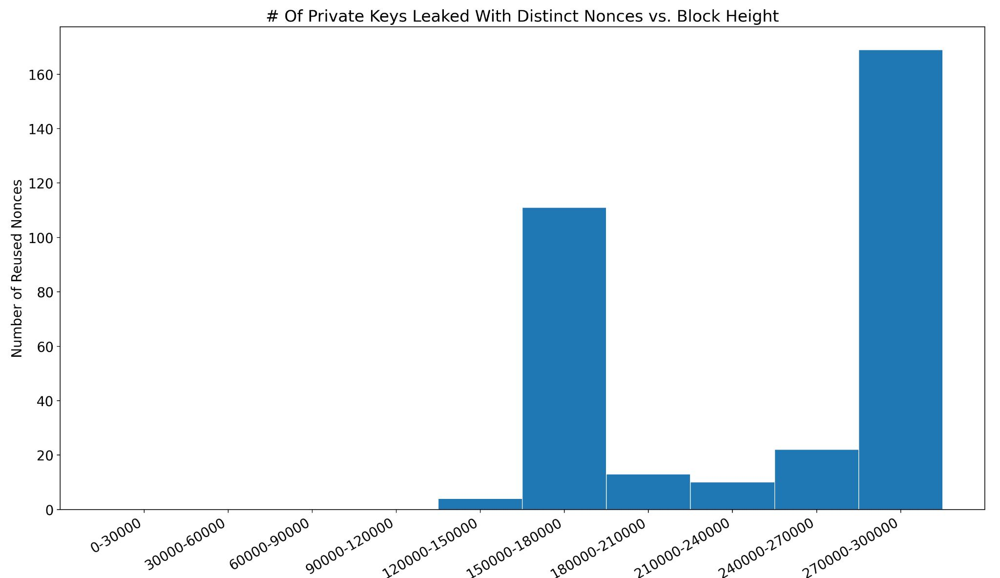
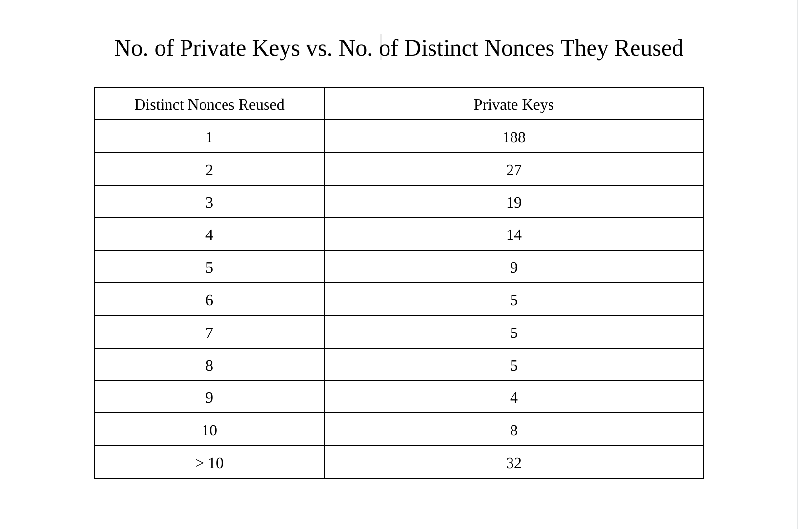
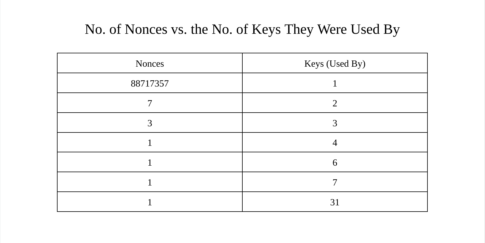

When I was initially learning about the steps to creating a valid Bitcoin transaction, I remember reading a few sentences about how reusing nonces when creating signatures is detrimental to the security of the funds. At the time I didn’t think much of it and just wrote it off as an additional thing to keep in mind when writing wallet software. Then a few months ago, I decided to revisit how a testnet wallet that I had written does transaction construction, specifically the signing process. This led me to looking at how my wallet does nonce generation, and a technique that my wallet uses to guarantee that a unique nonce is used every time. This time around, I decided to dig a little deeper into this topic.
 
 
Nonces are not supposed to be reused in Bitcoin transactions, because that can lead to a loss of funds. There are numerous questions (not all of which appear to be well-intentioned) on [Bitcoin Stack Exchange](https://bitcoin.stackexchange.com/) asking about nonce-reuse and how to steal Bitcoin from someone who has made this mistake. There are also a few posts on [Bitcoin Talk](https://bitcointalk.org/) about how there are now bots who steal bitcoin from addresses that have reused a nonces in the past.
 
 
So, if this is already a long-established problem with well-known solutions, one of which I hinted at above with the example of my own wallet, then why take out the time to write about this? Nonce reuse has usually been talked about in the context of “never do this”, and there are now fewer instances of loss of funds due to nonce-reuse because wallet software has greatly improved since Bitcoin’s earlier days. However, there hasn’t been much historical analysis on this subject. I looked for articles relating to this topic, but there weren’t that many, and the ones that did exist were either outdated or didn’t go into as much detail as I would have liked. 
 
 
So, I decided to try and look at the prevalence of nonce reuse over time by using information from my bitcoin node. I have decided to write about this in multiple parts, because scans for finding nonce reuse can take some time, and dissecting that data to find outliers, patterns, and the reasoning behind some of that data can take even longer. Having multiple parts will allow me to focus on different facets of this topic in each post.
 
 
This first part details where nonces are actually used in signature creation, my initial implementation of a nonce reuse scanner, certain data which I thought might be of interest if collected, and some initial data that I have collected thus far.

### A Quick Refresher on Signature Construction in Bitcoin
> Note: If you are completely unfamiliar with ECDSA and signatures in Bitcoin, I would recommend reading through the first three chapters of [Programming Bitcoin](https://github.com/jimmysong/programmingbitcoin) by Jimmy Song.

Given the following (it should be noted that the lowercase variables are scalars while the uppercase variables are points):
 - G _generator point_
 - e  _private key_
 - P = e * G _public key_
 - k _secret nonce value_
 - R = k * G
 - r _the x-coordinate of R_
 - z _the message that is being signed (the sighash)_

Calculate s:
- [s = (h + re)/k (all mod N)](https://bitcoin.stackexchange.com/a/73624/131112)

And so the full signature becomes:
- {r, s}

### What is a Nonce and Why Can’t the Same Private Key Use One Twice?
The whole point of a nonce is that it introduces randomness to the equation, but the purpose of a nonce is defeated if the same nonce is used twice for the same private key and different messages. Here is why that is a problem:
 
 
Given two signatures {r, s1} and {r, s2} of different messages z1 and z2 with the same nonce and the same key (k, r, and e are the same both times) we get the following equations.
 - s1 = (z1 + re)/k
 - s2 = (z2 + re)/k

After multiplying both with k…
 - s1 * k = z1 + re
 - s2 * k = z2 + re

…we just have a simple system of equations, and we can subtract one from the other to obtain the nonce private key:
 - k(s1 - s2) = z1 - z2
 - k = (z1 - z2)/(s1 - s2)

Once we know the nonce private key, we can calculate the actual private key by doing the following:
 - k * s1 = z1 + re
 - re = k * s1 - z1
 - e = (k * s1 - z1)/r

This is why nonce reuse (k) is so dangerous.
### Has nonce reuse actually occurred in Bitcoin?
The odds of this occurring by chance are miniscule in an ideal situation, but because of bad sources of entropy and faulty wallet software, there are quite a few examples of the same nonce being used with multiple signatures. For an example, take a look at this [post](https://bitcointalk.org/index.php?topic=271486.0) on bitcointalk describing one of the more damaging bugs related to nonce reuse.

### Edge Cases to Keep in Mind
While these edge cases could get annoying to continuously keep in mind while I was working on this, I realized they would be quite interesting to investigate using the data collected, as I will describe in the next section.
 - A nonce can be used by the same private key more than twice
 - A private key can use multiple nonces at least twice
 - A nonce can be used by multiple private keys

### Data of Interest
#### Number of Private Keys Leaked in Relation to Block Height
My initial motivation for nonce-reuse scanning into this was curiosity in regards to how the levels of nonce reuse vary over time. It is important to note that “number of private keys leaked” is not equivalent to “number of nonces reused”, because the same nonce can be reused by multiple private keys. For example, three private keys can each use the same nonce twice, and this would lead to 3 private keys leaked, but only one distinct nonce being reused.
 
 
It will also be important to look at the percentage of private keys leaked out of the total number of private keys active on the network at the given time, as opposed to just the number of private keys leaked. This is because the more recent blocks have a lot more transactions than the older blocks.

#### Leaking The Same Private Key Multiple Times
A private key can be leaked multiple times. For example if one nonce is used twice with the same private key, and then again twice with another nonce. This will show up as two data points on a graph of private keys leaked with distinct nonces. I wrote a short script, which I will walk through in a later post,  to see how frequently a private key is leaked multiple times. This is important because if many private keys have been leaked multiple times, then the data might not indicate what it intuitively appears to indicate (# of private keys leaked due to nonce reuse over time). 

#### Nonces Being Reused in Legacy vs. Segwit v0 Inputs
I would expect far fewer nonces to be reused in Segwit v0 inputs. This is for two reasons:

1. Segwit v0 inputs started getting used in 2017. In 2017 the wallet software was more advanced than it was before.
1. At least in the situation of nonces getting reused because of outdated/bad quality wallet software, I would think that if a wallet went to the trouble of implementing spending segwit outputs, their signature construction is up to industry standard  (ie. they use a technique to ensure nonce reuse never happens). 
I was also curious to see if any nonces were used in both a legacy and a segwit v0 input. I highly doubt it, but I will still run a check to see if this has occurred. It will also be interesting to see if the same public key has been used to create both a segwit v0 address and a legacy address.

#### Nonces Being Used With Distinct Private Keys
This check involves whether any nonces have been used by multiple private keys. If this were to occur, it would not be as problematic as  some of the other situations discussed thus far.  Unlike with the situation where the same private key uses the same nonce twice, any arbitrary outside observer monitoring the blockchain can’t calculate the private key. However, assuming that the two distinct private keys that have used the same nonce belong to two different people, these two people can calculate each other’s private key.
 
 
Let’s call the owner of the first address Alice, and the owner of the second address Bob. As mentioned above, if the k value is known, then the following equation can be used to calculate the private key:
 - e = (k × s - z)/r

So how does Alice know Bob’s k value if they both used the same nonce? Bob’s signature will contain r, which is the x-coordinate of kG. If Alice and Bob have the same r value, they must have both had the same k. If they both had the same k, Alice can derive what the k value was using the following equation:

 - [k = (d × r + z)/s](https://bitcoin.stackexchange.com/a/116826/131112)

She can do this because she knows her own private key, knows the r value from the signature, knows the message from the transaction, and knows the s from the signature as well. Alice needs to calculate her k value because she didn’t store her k value. With this k value, she can calculate Bob’s private key and steal all his funds.  However, the odds that 2 unrelated parties use the same nonce are ridiculously low, unless the nonce was not picked randomly. A nonce not being picked randomly means that bad entropy was used, or the nonce was previously shared.
 
 
Again, the odds of funds actually being lost because of this are astronomically low, but I thought it was interesting to think about because such a scenario being a problem was not immediately obvious to me.

### Potential Heuristics to Identify Intentional Private Key Leaks
The possibility of people intentionally leaking private keys can’t be discounted, especially when looking at the earlier days of Bitcoin when more experimentation was done on the main chain. These can’t definitively determine whether or not a nonce was purposefully reused, but they can certainly be a good starting point. Looking at more information relevant to a specific instance of reuse will also be useful.
 - Using a nonce that results in a very short r-value  (for the fee benefit)
 - High reuse count (especially across multiple transactions)
 - Distinct nonces each being used exactly twice in the same transaction
 - Spending Bitcoin that will be burnt anyways (eg. using OP_RETURN)

### Implementing a Nonce Reuse Scanner
Though I am still modifying and optimizing my implementation of such a scanner, my overall approach has remained the same. In order to figure out the frequency of nonce reuse over time, I need to scan the blockchain, keep track of nonces and the public keys that used those nonces, and keep track of the heights at which nonce reuse was occurring. In order to do this, I decided to modify Bitcoin Core itself as opposed to using RPCs to get this kind of information because I was already familiar with the codebase. Because of this, I didn’t need to write additional code to deal with transaction indices, checking output types, etc. and it was probably faster. I used a [leveldb](https://github.com/google/leveldb) database to keep track of the relevant information.

### Initial Data & Patterns Observed
The data below has been obtained by scanning for nonce reuse up to the block at height 301102, which was mined in May of 2014. The following parts of this series will contain more recent data as well as a more thorough analysis of specific instances of nonce reuse. 
 
 
The first nonce reused in a P2PKH transaction was at height 121487 in transaction [19edfbf79bca8d11b133e1b52e310bdf20a86135bb87fbbce2e5318a1b1791b4](https://mempool.space/tx/19edfbf79bca8d11b133e1b52e310bdf20a86135bb87fbbce2e5318a1b1791b4), leaking the private key of the address [1A8TY7dxURcsRtPBs7fP6bDVzAgpgP4962](https://mempool.space/address/1A8TY7dxURcsRtPBs7fP6bDVzAgpgP4962).
 
 
Below is a graph of the number of private keys leaked by reusing distinct nonces over time. It is important to note that below there could be multiple nonces leaking the same private key. 

 
 
I found it quite surprising how many private keys were leaked by reusing multiple distinct nonces. It turns out that by 2014 ~40% of private keys who had reused nonces reused more than one nonce. It can be hard to determine how many of these were intentional because after calculating the private key of an address, anyone can make an address reuse as many nonces as they like with that address. 

The number of nonces used with multiple public keys, as shown in the table below, is far less surprising. 

 
 
The nonce which has been used 31 times with distinct public keys has the r value of `79be667ef9dcbbac55a06295ce870b07029bfcdb2dce28d959f2815b16f81798`. This is actually the x-coordinate of the generator point of secp256k1. This makes the corresponding k value 1. There is no point in using 1 as the k value, because the r value is the same size,  but it would appear that numerous people have done so.

### Solutions To This Problem
So far this has been and will continue to be more of a historical analysis largely due to the fact that there are simple ways to prevent nonce reuse, both as users or producers of wallet software. These methods are industry standard at this point. The first and simplest method, which the user can perform, is just to not reuse public keys (which implies not reusing addresses). If you never use the same public key more than once, you can never use the same nonce twice with the same public key. Not reusing addresses is a good idea because of privacy as well, as anyone who has even a basic understanding of how Bitcoin works under the hood already knows.
 
 
The other solution to this problem, which has to be implemented on the wallet software level by developers, is called deterministic nonce generation. In simple terms, this works by generating a nonce that takes  into account the message being signed, as well as the private key, which results in a deterministically unique nonce every time a new input is being spent. This is because even though the private key can be the same, the message will always be different. I would expect every mainstream, reputable wallet these days to be using deterministic nonce generation.

---

Though I have already found some interesting data in this post, this has barely scratched the surface of all of the data to obtain. The next post in this series will contain more details about how I am obtaining this data, the scripts I am using to understand the data and obtain certain statistics, general data about more recent blocks, and information about particularly interesting cases of nonce reuse.

> Thanks to Murch for reviewing this article and discussing these ideas with me. _Please note that any mistakes and opinions contained within are my own_
