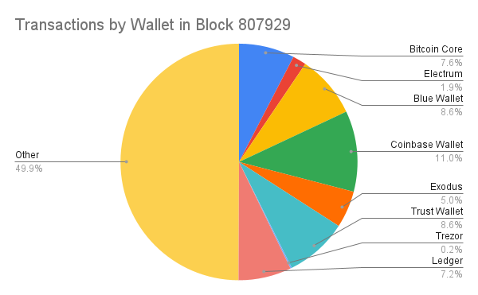
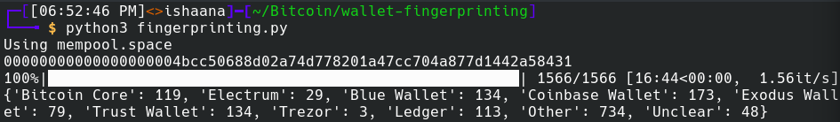

#### Table of Contents
1. [Background](#background)
2. [Methodology](#methodology)
3. [Results](#results)
4. [Conclusions](#conclusions)
5. [Appendix A](#appendix-a)
5. [Appendix B](#appendix-b)

---

This summer, I worked on identifying fingerprints in Bitcoin transactions, and automating their detection. By implementing a few heuristics, I was able to guess the originating wallet for about 50% of recent transactions. A wallet fingerprint is an aspect of a broadcasted Bitcoin transaction that can aid in identifying the wallet used to create that transaction. Identifying the wallet that created a transaction could ultimately lead to learning private information about the creator of a transaction. For example, if someone is using Trezor, they are more likely to have a substantial amount of Bitcoin compared to someone using a hot wallet, making them a more promising hacking target. 
 
 
A large part of pseudo-anonymity in Bitcoin means ensuring that an adversary can’t learn additional information about the person who created a transaction, beyond their public key. The presence of wallet fingerprints on transactions violates this privacy. In this work, I identify several fingerprints across a variety of wallet software and use them to demonstrate the extent to which wallet fingerprinting can be done effectively. Once fingerprints have been identified, automating their detection becomes trivial, and it is easy to collect information such as the following:

    

## Background
### The Consequences of Effective Wallet Fingerprinting

You can learn a lot about a user by looking at the wallet software they use. For example, if someone is using Bitcoin Core, they are more likely to have a deeper understanding of Bitcoin than someone who uses a more mainstream wallet with fewer features. Additionally, if someone is using a hardware wallet, it indicates that they likely have more Bitcoin than someone who uses a mobile wallet. Furthermore, this information is accessible to anyone who sends you Bitcoin, like an employer or customer, and anyone who you send Bitcoin to. On a practical level, if an attacker can identify the wallet that you are using, it becomes much easier to decide if you are a good target and to exploit known vulnerabilities in that particular software. 
 
 
	There are also issues with privacy measures that arise when transactions can be easily fingerprinted. For example, sometimes users use the same wallet software on both sides of a coinjoin transaction. If one of the users in the inputs is using a specific version of some software, and there is an output that is spent using this same software, then this shows that this input and output belong to the same user. This not only renders the coin-join ineffective for them, but it also lowers the confidentiality of other users in the coin-join. Because knowing the wallet someone uses is a privacy leak, this can make other privacy-preserving techniques less effective in general.
 
 
### Types of Fingerprints

I have identified a variety of fingerprints that can be combined to identify the wallet that created a given transaction. I have divided these fingerprints into four primary types:  Independent, Probabilistic, Dependent, and Temporal. These groups are not definite, and some fingerprints from one group can exhibit a few characteristics of another group. These groups roughly show how difficult a fingerprint is to identify in a transaction, and how much weightage that fingerprint should be given for identifying an originating wallet. 
 
 
Independent fingerprints can be seen directly in a transaction, and are independent from other aspects of the  transaction. This is the easiest type of fingerprint to detect. These fingerprints are generally simple and include a transaction’s version number, and the types of outputs being sent.
 
 
With Probabilistic fingerprints, almost every wallet will occasionally produce transactions that exhibit the fingerprint. The more examples there are of a transaction exhibiting certain behavior, the more confident we can be that wallet software that leaves the given fingerprint intentionally was used. These fingerprints are also independent of other characteristics of the transaction. A useful example of this is the input and output order in a transaction. Some wallets order their inputs lexicographically and outputs by ascending amount according to BIP-69. While a wallet that implements BIP-69 will always order all their inputs and outputs accordingly, a wallet that does not implement BIP-69 may conform to its rule by chance.
 
 
Dependent fingerprints rely on other heuristic-based information having been deduced correctly, such as being able to detect the change output correctly. Detecting change outputs can be quite easy using a few <a href="https://en.bitcoin.it/wiki/Privacy#Change_address_detection" target="_blank">simple heuristics</a>, but it would still be possible to guess incorrectly, so there should typically be less confidence with these fingerprinting methods.
 
 
The most uncommon fingerprints are Temporal. They either need mempool data in order to be detected, or take into account the block heights of certain transactions. This makes them more difficult to identify. Temporal fingerprints typically relate to some sort of fee-bumping and/or unconfirmed inputs.
### Previous Wallet Fingerprinting Research
Wallet fingerprinting is not an unknown concept to the Bitcoin community. It is typically discussed theoretically and is considered something that should generally be avoided. To the extent that fingerprinting research has been done, it has typically been focused on just one fingerprint or just a few wallets. Examples of this include achow101’s <a href="https://github.com/achow101/wallet-fingerprinting/blob/main/fingerprints.md" target="_blank">list of Bitcoin Core and Electrum fingerprints</a> and 0xb10c’s <a href="https://b10c.me/observations/03-blockchaincom-recommendations/" target="_blank">blog post on using feerates to fingerprint blockchain.com transactions</a>. In this work, I aimed at getting a wider understanding of fingerprinting, and the scale to which it can be done.

## Methodology
### Assumptions
Because fingerprinting all versions of all available wallet software would be infeasible, there are certain things to keep in mind when looking at the following methodology and results. Firstly, when I refer to a certain wallet, I mean the version of that particular software listed below. It is likely that these fingerprints also apply to other versions of these wallets, but that has not been verified. Additionally, these fingerprints might not apply to wallets that are being run with settings different from the defaults. Finally, there are many wallets that I have not looked at that may have the same fingerprints as the wallets which I did look at, so none of the fingerprint combinations discussed here should be considered as belonging exclusively to a single wallet. 

### Looking at a Variety of Wallets
In order to represent different kinds of Bitcoin software I decided to look at eight wallets with varying security models and target users:

- Bitcoin Core (v. 25.0)
- Electrum (v. 4.4.5)
- Blue Wallet (v. 6.4.6 iOS)
- Exodus (v. 23.7.2 iOS)
- Trust Wallet (v. 9. 0 iOS)
- Coinbase Wallet (v. 28.53 iOS)
- Trezor Suite (v. 23.7.2)
- Ledger Live (v. 2.64.2)

### Identifying Fingerprints
#### Looking at Wallet Software

The majority of the investigated wallets are open-source (Bitcoin Core, Electrum, Blue Wallet, Trezor, Ledger). This not only allows for looking at the code and determining fingerprints from there, but also for looking at pull requests where fingerprints may have been added or issues where fingerprints have been reported and discussed. However, looking through the code and GitHub repositories for all five open-source wallets would take an unreasonable amount of time. I kept the repositories in mind as a backup, for confirming observed fingerprints, and to check if anyone had already reported them. 
 
 
A faster method of finding fingerprints is to explore the wallet’s interface and options, and to create a few transactions using the software.
#### Exploring the Wallet Interface
Many simple fingerprints can be identified just by looking at the options that a wallet provides. This includes the possible spending addresses, whether having a wallet that spends multiple output types is possible, and whether spending to more than one recipient is possible.

#### Creating Transactions
When looking for fingerprints, not all transactions are created equal. The transactions created for this purpose should contain as much information as possible. For example, a transaction with a single input and single output doesn’t tell us much. It tells us nothing about the wallet’s typical change index, how the inputs and outputs are sorted, whether or not it reuses the input address as the change address, etc. 
 
 
With this in mind, I created many transactions using these wallets and looked at them for fingerprints. I ended up creating more [transactions](#appendix-b) for the wallets that were harder to fingerprint. After creating the first transaction, I started looking for Independent fingerprints. Then I tried to see if there were any patterns that could be identified, such as those related to input order and change index. Then, I created additional transactions to try to either confirm or disprove the presence of these patterns in all transactions of that kind created by this wallet. After finding these fingerprints, I wrote Python functions to verify them.
    
## Results
### Findings

Here are my results shown as a table of possible wallet fingerprints by wallet software. The full explanation of each fingerprint can be found [here](#appendix-a). 

    

There are some things here which I find particularly note-worthy:

- Ledger doesn’t seem to shuffle its inputs after it performs coin selection. Ledger’s default coin selection algorithm is historical (the oldest UTXOs get spent first). 
- All of the Trezor transactions which I created followed BIP-69.
- Exodus only provides a single address and reuses that address as change, but if you go into the settings, there is the option to use multiple addresses. It is interesting that this is not the default.
- In general, it appears that wallets that also deal with altcoins (such as Exodus and Trust) only use a single address. This is likely because it is common in many altcoins to use a single address.
- Simple fingerprints can be very useful. For example support for spending multiple UTXO types or paying more than one recipient are simple to detect, but vary widely amongst wallets. For example, Bitcoin Core is one of the few wallets that allows for spending multiple UTXO types and sending to more than two outputs. Ledger, on the other hand, doesn’t allow for either of these things.

### Automating the Detection of Fingerprints on Transactions

Using the fingerprints found above, it became simple to write a series of functions to A) detect fingerprints in transactions, B) Use the presence or absence of these fingerprints to rule out or substantiate wallets as potential transaction originators, and C) do this on a wider scale for large groups of transactions, such as those in a given block or in a mempool snapshot. I was able to write these functions in Python, and they can be found in this GitHub <a href="https://github.com/ishaanam/wallet-fingerprinting" target="_blank">repository</a>. They can be run locally (see repository for instructions) or on .
 
 
	Transactions and blocks are fetched using either <a href="https://bitcoincore.org/" target="_blank">Bitcoin Core</a> or the <a href="https://mempool.space/docs/api/rest" target="_blank">Mempool Space REST API</a>. Some of the functions take a deserialized transaction and check for the presence of a fingerprint or multiple fingerprints (for example it is easier to check for different types of output orders at once instead of doing it individually). There is a `detect_wallet(tx_hash)` function which uses these functions to identify fingerprints and use them to determine the wallet. 
 
 
It might seem intuitive that a wallet would be determined based on the presence of certain fingerprints. However, because of probabilistic fingerprints (the fingerprint can be present even if a wallet does not leave that fingerprint) it is actually more effective to rule out wallets based on the absence of fingerprints. For example, if a transaction does anti-fee-sniping (which is an independent fingerprint), but does not follow BIP-69 (which is probabilistic), then it was likely created by Bitcoin Core. Wallets are eliminated by the absence of fingerprints. If there is only one wallet left, it is likely that wallet was used to create the transaction. If there are no wallets left, it means that it could not have been created by one of the eight wallets. If multiple possible wallets remain, there is not enough information to determine the wallet. 
 
 
`detect_wallet` can be used for all of the transactions in a block to produce a result as shown below, which provides a breakdown of how many transactions were likely created by each of the wallets.
 
 

    

 
 
Note that below the “Other” field indicates the number of transactions that could not have been created by one of the eight investigated wallets because they have a different combination of fingerprints. The “Unclear” field indicates the number of transactions that could have been created by multiple of the eight wallets, and there is not enough information to narrow it down to a single wallet. 

## Conclusions
There are many additional facets of wallet fingerprinting that can be looked into further. Sometimes there are not enough fingerprints present in a transaction to get a reasonable idea of the wallet that created it. To find more fingerprints, clustering algorithms could be used to find other addresses belonging to the same wallet. This would be helpful because then all related transactions can be searched for fingerprints. Having multiple related transactions is especially useful for detecting probabilistic fingerprints because there are more examples of certain behavior. Generally  de-anonymization techniques are even more effective when multiple are used in tandem. 
 
 
There is no clear cut solution to the issues discussed here. While some fingerprints would be trivial to eliminate, it will be difficult to eliminate fingerprinting entirely. Just because something is a fingerprint does not automatically mean that it should not be done by a wallet. For instance, all transactions of a wallet having a certain input order or change index should definitely be modified, but things like anti-fee-sniping and the spending of taproot UTXOs are still worthwhile.
## Acknowledgements
Thanks to Clara Shikhelman and Mark Erhardt for their help discussing this project with me and reviewing this work. Thanks to Andrew Chow for giving me a few spare hardware wallets to look for fingerprints on. Any mistakes and opinions contained within are my own.
## Appendix A
### Independent
- <a href="https://bitcoinops.org/en/topics/fee-sniping/" target="_blank">__Anti-Fee-Sniping__</a>: A mechanism to discourage chain reorgs. This consists of setting the `nLockTime` value of the transaction to the current block height, so that the transaction can’t be included in an earlier block by miners trying to take fees from the previous miners of that block. Locking transactions to the upcoming block ensures that their fees can only be collected by the next block, or any blocks after that. 
- __Input Types__: Some wallets only create addresses of certain types.
    - __Inputs of Multiple Types__: Some wallets allow for multiple input types to be spent in the same transaction.
- __Output Types__: Some wallets only support sending to certain address / scriptPubKey types. 
- __Number of Outputs__: Certain wallets only support sending to a single recipient (plus change). Some wallets try to create changeless transactions.
- __Signaling Opt-in RBF__: Certain wallets create transactions which opt-into RBF by default, or provide an option for the user to do so.  
- __Compressed/Uncompressed ECDSA Public Keys__: Uncompressed ECDSA public keys are now non-standard in all output types, but previously they were allowed for P2PKH and P2SH (see Bitcoin Core <a href="https://github.com/bitcoin/bitcoin/pull/8499" target="_blank">#8499</a>). This fingerprint is more useful with older transactions.
- __Transaction Version__: Only nVersion 1 and 2 are standard. Use of certain opcodes requires nVersion to be set to 2. Some wallets generally use version 2, while others still use version 1.

### Probabilistic

- <a href="https://github.com/bitcoin/bips/blob/master/bip-0069.mediawiki" target="_blank">__BIP 69__</a>: The lexicographical ordering of inputs and outputs is specified by BIP 69. While this was created in order to mitigate privacy weaknesses in wallet software as a result of input and output ordering, this has ended up becoming a fingerprint in itself. If a minority of wallets implement an anti-fingerprinting measure, it turns into a fingerprint. This is probabilistic because it is possible for wallet software to unintentionally order the inputs and outputs lexicographically. 
- __Low-R-Grinding__: In a signature, the r value is the x-coordinate of the secret nonce value. A low-r signature is a signature which has an r value that can be encoded with 32 bytes instead of 33 bytes. A few wallets generate signatures until they have a signature with a low-r value, creating a smaller overall transaction size, to save on  fees and simplify fee estimation. This is probabilistic because it is possible for wallet software to unintentionally create signatures that all have low rs. On the other hand, the presence of a high r signature can be used to rule out all wallets that implement low-r-grinding.
- __Input Order__: Input order fingerprints can be a result of the wallet not shuffling the inputs after performing <a href="https://bitcoinops.org/en/topics/coin-selection/" target="blank_">coin selection</a>. This is probabilistic because it could seem like a wallet is ordering inputs a certain way, but the inputs just happened to be shuffled in that manner. The common cases are:
    - Smallest UTXO (by value) first
    - Largest UTXO (by value) first
    - Oldest first
	
- __Manual Entering of Fees/Feerate__: Some signs of this fingerprint include:
    - Round dollar amount
    - Round satoshi amount
     
	This is probabilistic because it is possible that a feerate recommendation provided a round dollar or satoshi amount.

### Dependent

- __Change Position in Outputs__: Certain wallets always use the same output index for change (usually the first or last index). Other wallets randomize the change index.
- __Change Type__: 
    - Does the change type match one of the output types?
    - Does the change type match one of the input types instead?

### Temporal

- __Spending Unconfirmed Outputs__
    - Are unconfirmed change outputs ever spent?
    - Are all types of unconfirmed outputs spent?
- __Submission of Replacement Transactions__: This should not be confused with simply opting into RBF. This is when a user actually creates a replacement transaction for a transaction which has opted into RBF. There are wallets that create transactions which opt-in to RBF, but don’t actually allow users to fee-bump their transactions.
- __Feerate Recommendations__: Are fee recommendations being used by the wallet? If so, where does the wallet get its fee recommendations? If a transaction had the same feerate as that recommended by a certain wallet that uses somewhat unique fee recommendations, this is indicative of that wallet being used.

## Appendix B

The following are transactions which demonstrate the presence of some of the fingerprints described above.
 
 

Blue Wallet: 

2fd284ed739a59ac6d6bd7f94fa2a244dd0cf88981551272b96708aebf260a57

702903c9818ac7847c9a2d9f948c9ee1ab25236821836170ef6919cd12c9e04c

1bf659e17568e48d6f47bb5470bc8df567cfe89d79c6e38cafbe798f43d5da22

Electrum:

5d857401648a667303cde43295bce1326e6329353eac3dddf15b151e701405e7

Trezor: 

C1ba2810ac35c2d17503792ee728a3df9c41c658f5442d9326eb69580bcb7dd6

bc8c701594207360a409d64a9c797a46dd11a2d468948e8bb98e865249ca17e3

999b46e55df4e57a2a8ba0de28ae9547ce9bf2dbc8cceaddf0fb13a7af8923e7

Ledger: 

C1094c70a9b23ca5d755234cffefca69f639d7a938f745dfd1190cc9c9d8b5ad

1c2dbae13f1762aae0b427107babfb013849c6e3262bb302b264ef4f93f76e3d

b2863a85081cd113094d50878153fab5c3160999e5fd2e044782b851c4dc72e1

Ffa8a398325ec1a4e39ca5dea0383bbdc2b01528c5ceb215e821d41d435b5d09

Exodus: 

6f8c37db6ed88bfd0fd483963ebf06c5557326f8d2a3617af5ceba878442e1ad

Coinbase Wallet:

Bd4a846c05c37029caf7f6cef453112eef362ca511bd6a52f9082d85b7b2f207

60849af6e56c2ad0facd601cc5014398210898a7e6d5b9280b54f6395349663a

9aa3a7086730aadc3fc0a7494b6f8fb27e6a862e707917af96662d145950dbd6

96beaefd8df5b25d95e4fbc1fd3c5949f9a61f59d763629fa768b555426e90c8

Trust: 

43f901163b8c27567d365f56bb804bd74904bd78d58017905f3c36cac971d9b6
